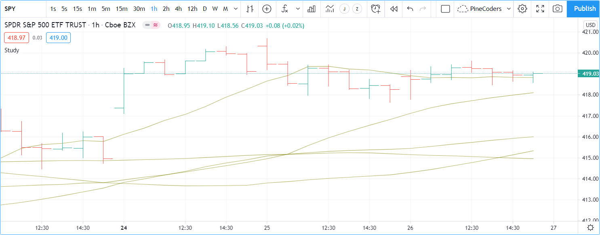

Colors
======

.. contents:: :local:
    :depth: 3

Introduction
------------

Script visuals can play a critical role in the usability of the indicators we write in Pine. Well-designed plots and drawings make indicators easier to use and understand. Good visual designs establish a visual hierarchy that allows the more important information to stand out and the less important one to not get in the way.

Using colors can be as simple or as involved as your script requirements require, or as your programming skills allow. In Pine, colors can be applied to:

- Any element you can plot or draw in an indicator's visual space, be it lines, text or candles.
- The background of a script's visual space, whether the script is running in its own pane, or in overlay mode on the chart.
- The color of bars or the body of candles appearing on a chart.

A script can only color the elements it places in its own visual space. The only exception to this rule is that a pane indicator can color chart bars or candles.

Pine has built-in colors such as `color.green <https://www.tradingview.com/pine-script-reference/v4/#var_color{dot}green>`__, as well as functions like `color.rgb() <https://www.tradingview.com/pine-script-reference/v4/#fun_color{dot}rgb>`__ which allow you to generate any color in the RGBA color space.

Transparency
^^^^^^^^^^^^

Each color in Pine is defined by four values:

- Its red, green and blue components (0-255), following the `RGB color model <https://en.wikipedia.org/wiki/RGB_color_space>`__.
- Its transparency (0-100), often referred to as the Alpha channel outside Pine, as defined in the `RGBA color model <https://en.wikipedia.org/wiki/RGB_color_space>`__.

The transparency of a color defines how opaque it is: zero is fully opaque, 100 makes the color—whichever it is—invisible. Controlling transparency can be crucial in more involved color visuals, to control which colors dominate the others, for example, and how they mix together when superimposed.

Using colors and transparency
-----------------------------

There are 17 built-in colors in Pine. This table lists their names, hexadecimal equivalent, and RGB values as arguments to `color.rgb() <https://www.tradingview.com/pine-script-reference/v4/#fun_color{dot}rgb>`__:

+---------------+---------+------------------------+
| Name          | Hex     | RGB values             |
+===============+=========+========================+
| color.aqua    | #00BCD4 | color.rgb(0,188,212)   |
+---------------+---------+------------------------+
| color.black   | #363A45 | color.rgb(54,58,69)    |
+---------------+---------+------------------------+
| color.blue    | #2196F3 | color.rgb(33,150,243)  |
+---------------+---------+------------------------+
| color.fuchsia | #E040FB | color.rgb(224,64,251)  |
+---------------+---------+------------------------+
| color.gray    | #787B86 | color.rgb(120,123,134) |
+---------------+---------+------------------------+
| color.green   | #4CAF50 | color.rgb(76,175,80)   |
+---------------+---------+------------------------+
| color.lime    | #00E676 | color.rgb(0,230,118)   |
+---------------+---------+------------------------+
| color.maroon  | #880E4F | color.rgb(136,14,79)   |
+---------------+---------+------------------------+
| color.navy    | #311B92 | color.rgb(49,27,146)   |
+---------------+---------+------------------------+
| color.olive   | #808000 | color.rgb(128,128,0)   |
+---------------+---------+------------------------+
| color.orange  | #FF9800 | color.rgb(255,152,0)   |
+---------------+---------+------------------------+
| color.purple  | #9C27B0 | color.rgb(156,39,176)  |
+---------------+---------+------------------------+
| color.red     | #FF5252 | color.rgb(255,82,82)   |
+---------------+---------+------------------------+
| color.silver  | #B2B5BE | color.rgb(178,181,190) |
+---------------+---------+------------------------+
| color.teal    | #00897B | color.rgb(0,137,123)   |
+---------------+---------+------------------------+
| color.white   | #FFFFFF | color.rgb(255,255,255) |
+---------------+---------+------------------------+
| color.yellow  | #FFEB3B | color.rgb(255,235,59)  |
+---------------+---------+------------------------+

All these plots use the same color: `color.olive <https://www.tradingview.com/pine-script-reference/v4/#var_color{dot}olive>`__, with a transparency of 40. 
They are functinally equivalent:

.. code-block:: pine
    :linenos:

    //@version=4
    study("", "", true)
    plot(sma(close, 10), "10", color.olive, transp = 40)
    plot(sma(close, 30), "30", #808000, transp = 40)
    plot(sma(close, 50), "50", #80800099)
    plot(sma(close, 70), "70", color.new(color.olive, 40))
    plot(sma(close, 90), "90", color.rgb(128, 128, 0, 40))

.. note:: The first two `plot() <https://www.tradingview.com/pine-script-reference/v4/#fun_plot>`__ calls on lines 3 and 4 which specify transparency using the ``transp`` parameter should be avoided, as they are not as flexible to use and will be deprecated in Pine v5. Using the ``transp`` parameter to define transparency is not as flexible because it requires an argument of "input integer" type, which entails it can must be known before the script is executed, and so cannot be calculate dynamically, as your script executes bar to bar.

Using dynamic colors
--------------------

Building gradients
------------------

Color selection in script inputs
--------------------------------

Tips
----

Z-order
^^^^^^^

Providing color selection for script users
^^^^^^^^^^^^^^^^^^^^^^^^^^^^^^^^^^^^^^^^^^

Choose colors that work well on light and dark chart backgrounds
^^^^^^^^^^^^^^^^^^^^^^^^^^^^^^^^^^^^^^^^^^^^^^^^^^^^^^^^^^^^^^^^

