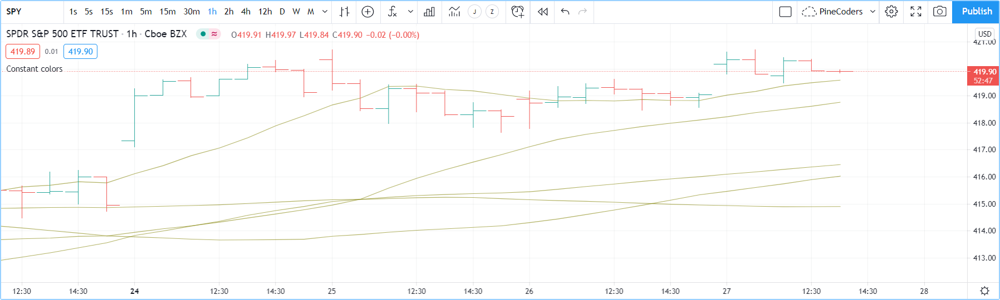
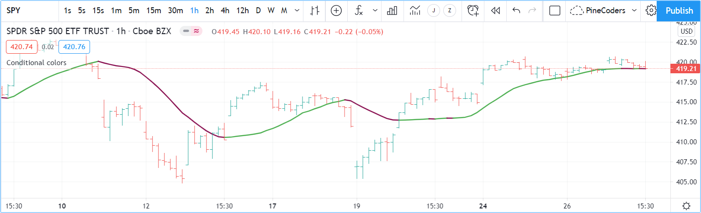

Colors
======

.. contents:: :local:
    :depth: 3

Introduction
------------

Script visuals can play a critical role in the usability of the indicators we write in Pine. Well-designed plots and drawings make indicators easier to use and understand. Good visual designs establish a visual hierarchy that allows the more important information to stand out and the less important one to not get in the way.

Using colors in Pine can be as simple as you want, or as involved as your script requirements require, or as your programming skills allow. In Pine, colors can be applied to:

- Any element you can plot or draw in an indicator's visual space, be it lines, text or candles.
- The background of a script's visual space, whether the script is running in its own pane, or in overlay mode on the chart.
- The color of bars or the body of candles appearing on a chart.

A script can only color the elements it places in its own visual space. The only exception to this rule is that a pane indicator can color chart bars or candles.

Pine has built-in colors such as `color.green <https://www.tradingview.com/pine-script-reference/v4/#var_color{dot}green>`__, as well as functions like `color.rgb() <https://www.tradingview.com/pine-script-reference/v4/#fun_color{dot}rgb>`__ which allow you to dynamically generate any color in the RGBA color space.

Transparency
^^^^^^^^^^^^

Each color in Pine is defined by four values:

- Its red, green and blue components (0-255), following the `RGB color model <https://en.wikipedia.org/wiki/RGB_color_space>`__.
- Its transparency (0-100), often referred to as the Alpha channel outside Pine, as defined in the `RGBA color model <https://en.wikipedia.org/wiki/RGB_color_space>`__.

The transparency of a color defines how opaque it is: zero is fully opaque, 100 makes the color—whichever it is—invisible. Modulating transparency can be crucial in more involved color visuals or when using backgrounds, to control which colors dominate the others, and how they mix together when superimposed.

Using colors
------------

Constant colors
^^^^^^^^^^^^^^^

There are 17 built-in colors in Pine. This table lists their names, hexadecimal equivalent, and RGB values as arguments to `color.rgb() <https://www.tradingview.com/pine-script-reference/v4/#fun_color{dot}rgb>`__:

+---------------+---------+--------------------------+
| Name          | Hex     | RGB values               |
+===============+=========+==========================+
| color.aqua    | #00BCD4 | color.rgb(0, 188, 212)   |
+---------------+---------+--------------------------+
| color.black   | #363A45 | color.rgb(54, 58, 69)    |
+---------------+---------+--------------------------+
| color.blue    | #2196F3 | color.rgb(33, 150, 243)  |
+---------------+---------+--------------------------+
| color.fuchsia | #E040FB | color.rgb(224, 64, 251)  |
+---------------+---------+--------------------------+
| color.gray    | #787B86 | color.rgb(120, 123, 134) |
+---------------+---------+--------------------------+
| color.green   | #4CAF50 | color.rgb(76, 175, 80)   |
+---------------+---------+--------------------------+
| color.lime    | #00E676 | color.rgb(0, 230, 118)   |
+---------------+---------+--------------------------+
| color.maroon  | #880E4F | color.rgb(136,  14, 79)  |
+---------------+---------+--------------------------+
| color.navy    | #311B92 | color.rgb(49, 27, 146)   |
+---------------+---------+--------------------------+
| color.olive   | #808000 | color.rgb(128, 128, 0)   |
+---------------+---------+--------------------------+
| color.orange  | #FF9800 | color.rgb(255, 152, 0)   |
+---------------+---------+--------------------------+
| color.purple  | #9C27B0 | color.rgb(156, 39, 176)  |
+---------------+---------+--------------------------+
| color.red     | #FF5252 | color.rgb(255, 82, 82)   |
+---------------+---------+--------------------------+
| color.silver  | #B2B5BE | color.rgb(178, 181, 190) |
+---------------+---------+--------------------------+
| color.teal    | #00897B | color.rgb(0, 137, 123)   |
+---------------+---------+--------------------------+
| color.white   | #FFFFFF | color.rgb(255, 255, 255) |
+---------------+---------+--------------------------+
| color.yellow  | #FFEB3B | color.rgb(255, 235, 59)  |
+---------------+---------+--------------------------+

All these plots use the same color: `color.olive <https://www.tradingview.com/pine-script-reference/v4/#var_color{dot}olive>`__, with a transparency of 40. 
They are functionally equivalent::

    //@version=4
    study("", "", true)
    // ————  Use `transp` parameter.
    plot(sma(close, 10), "10", color.olive, transp = 40)
    plot(sma(close, 30), "30", #808000, transp = 40)
    // ————  Transparency (#99) is included in the hex value.
    plot(sma(close, 50), "50", #80800099)
    // ————  Transparency is included in the color-generating function's arguments.
    plot(sma(close, 70), "70", color.new(color.olive, 40))
    plot(sma(close, 90), "90", color.rgb(128, 128, 0, 40))

.. note:: The first two `plot() <https://www.tradingview.com/pine-script-reference/v4/#fun_plot>`__ calls specify transparency using the ``transp`` parameter. This use should be avoided as the ``transp`` is slated for deprecation in Pine v5. Using the ``transp`` parameter to define transparency is not as flexible because it requires an argument of *input integer* type, which entails it must be known before the script is executed, and so cannot be calculated dynamically, as your script executes bar to bar. Additionally, if you use a ``color`` argument that already includes transparency information, as is done in the next three `plot() <https://www.tradingview.com/pine-script-reference/v4/#fun_plot>`__ calls, any argument used for the ``transp`` parameter would have no effect. This is also true for other functions with a ``transp`` parameter.

The colors in the previous script do not vary as the script executes bar to bar. Sometimes, however, colors need to be created as the script executes on each bar because they depend on conditions that are unknown at compile time, or when the script begins execution on bar zero. For those cases, Pine programmers have two options:

#. Use conditional conditional statements to select colors from a few pre-dertermined base colors.
#. Build new colors dynamically, by calculating them as the script executes bar to bar, to implement color gradations, for example.

Conditional coloring
^^^^^^^^^^^^^^^^^^^^

Let's say you want to color a moving average in different colors, depending on some conditions you define. To do so, you can use a conditional statement that will select a different color for each of your states. Let's start by coloring a moving average in a bull color when it's rising, and in a bear color when it's falling::

    //@version=4
    study("Conditional colors", "", true)
    i_length   = input(20, "Length", minval = 2)
    i_c_maBull = input(color.green, "Bull")
    i_c_maBear = input(color.maroon, "Bear")
    float ma = sma(close, i_length)
    // Define our states.
    bool maRising  = rising(ma, 1)
    // Build our color.
    color c_ma = maRising ? i_c_maBull : i_c_maBear
    plot(ma, "MA", c_ma, 2)

Note that:

- We provide users of our script a selection of colors for our bull/bear colors.
- We define an ``maRising`` boolean variable which will hold ``true`` when the moving average is higher on the current bar than it was on the last.
- We define a ``c_ma`` color variable that is assigned one of our two colors, depending on the value of the ``maRising`` boolean. We use the `? : ternary operator <https://www.tradingview.com/pine-script-reference/v4/#op_{question}{colon}>`__ to write our conditional statement.

You can also use conditional colors to avoid plotting under certain conditions. Here, we plot high and low pivots using a line, but we do not want to plot anything when a new pivot comes in, to avoid the joints that would otherwise appear in pivot transitions. To do so, we test for pivot changes and use `na <https://www.tradingview.com/pine-script-reference/v4/#var_na>`__ as the color value when a change is detected, so that no line is plotted on that bar::

    //@version=4
    study("Conditional colors", "", true)
    i_legs = input(5, "Pivot Legs", minval = 1)
    i_c_pHi = input(color.olive, "High pivots")
    i_c_pLo = input(color.orange, "Low pivots")
    // Intialize the pivot level variables.
    var float pHi = na
    var float pLo = na
    // When a new pivot is detected, save its value.
    pHi := nz(pivothigh(high, i_legs, i_legs), pHi)
    pLo := nz(pivotlow( low,  i_legs, i_legs), pLo)
    // When a new pivot is detected, do not plot a color.
    plot(pHi, "High", change(pHi) ? na : i_c_pHi, 2, plot.style_line)
    plot(pLo, "Low",  change(pLo) ? na : i_c_pLo, 2, plot.style_line)

.. image:: images/Colors-ConditionalColors-2.png

To undertand how this code works, one must first know that `pivothigh() <https://www.tradingview.com/pine-script-reference/v4/#fun_pivothigh>`__ and `pivotlow() <https://www.tradingview.com/pine-script-reference/v4/#fun_pivotlow>`__, used as they are here without an argument to the ``source`` parameter, will return a value when they find a `high <https://www.tradingview.com/pine-script-reference/v4/#var_high>`__/`low <https://www.tradingview.com/pine-script-reference/v4/#var_low>`__ pivot, otherwise they return `na <https://www.tradingview.com/pine-script-reference/v4/#var_na>`__.

When we test the value returned by the pivot function for `na <https://www.tradingview.com/pine-script-reference/v4/#var_na>`__ using the `nz() <https://www.tradingview.com/pine-script-reference/v4/#fun_nz>`__ function, we allow the value returned to be assigned to the ``pHi`` or ``pLo`` variables only when it is not `na <https://www.tradingview.com/pine-script-reference/v4/#var_na>`__, otherwise the previous value of the variable is simply reassigned to it, which has no impact on its value. Keep in mind that previous values of ``pHi`` and ``pLo`` are preserved bar to bar because we use the `var <https://www.tradingview.com/pine-script-reference/v4/#op_var>`__ keyword when initializing them, which causes the initialization to only occur on the first bar.

All that's left to do next is, when we plot our lines, to insert a ternary conditional statement that will yield `na <https://www.tradingview.com/pine-script-reference/v4/#var_na>`__ for the color when the pivot value changes, or the color selected in the script's inputs when the pivot level does not change.

Calculating colors
^^^^^^^^^^^^^^^^^^

Using functions like `color.new() <https://www.tradingview.com/pine-script-reference/v4/#fun_color{dot}new>`__, `color.rgb() <https://www.tradingview.com/pine-script-reference/v4/#fun_color{dot}rgb>`__ and `color.from_gradient() <https://www.tradingview.com/pine-script-reference/v4/#fun_color{dot}from_gradient>`__, one can build colors on the fly, as the script executes bar to bar.

`color.new() <https://www.tradingview.com/pine-script-reference/v4/#fun_color{dot}new>`__ is most useful when you need to generate different transparency levels from a base color.

`color.rgb() <https://www.tradingview.com/pine-script-reference/v4/#fun_color{dot}rgb>`__ is useful when you need to build colors dynamically from varying components of RGB or transparency values. Whereas `color.rgb() <https://www.tradingview.com/pine-script-reference/v4/#fun_color{dot}rgb>`__ creates a color, its sister functions `color.r() <https://www.tradingview.com/pine-script-reference/v4/#fun_color{dot}r>`__, `color.g() <https://www.tradingview.com/pine-script-reference/v4/#fun_color{dot}g>`__, `color.b() <https://www.tradingview.com/pine-script-reference/v4/#fun_color{dot}b>`__ and `color.t() <https://www.tradingview.com/pine-script-reference/v4/#fun_color{dot}t>`__ can be used to extract the red, green, blue or transparency values from a color, which can then be used to generate a variant.

`color.from_gradient() <https://www.tradingview.com/pine-script-reference/v4/#fun_color{dot}from_gradient>`__ is useful to create linear gradients between two base colors. It determines which intermediary color to use by evaluating a source value against minimum and maximum values.

Let's put `color.new() <https://www.tradingview.com/pine-script-reference/v4/#fun_color{dot}new>`__ to use to create different transparencies of a base color to color volume columns::

Mixing transparencies
---------------------

TODO

Tips
----

Color selection through script Settings
^^^^^^^^^^^^^^^^^^^^^^^^^^^^^^^^^^^^^^^

The type of color you use in your scripts has an impact on how users of your script will be able to change the colors of your script's visuals. As long as you don't use colors whose RGBA components have to be calculated at runtime, script users will be able to modify the colors you use by going to your script's "Settings/Style" tab. Our first example script on this page meets that criteria, and the following screenshot shows how we used the script's "Settings/Style" tab to change the color of the first moving average:

.. image:: images/Colors-ColorsSelection-1.png

If your script uses a calculated color, i.e., a color where at least one of its RGBA components can only be known at runtime, then the "Settings/Style" tab will NOT offer users the usual color widgets they can use to modify your plot colors. Plots of the same script not using calculated colors will also be affected. In this script, for example, our first `plot() <https://www.tradingview.com/pine-script-reference/v4/#fun_plot>`__ call uses a calculated color, and the second one doesn't::

    //@version=4
    study("Calculated colors", "", true)
    float ma = sma(close, 20)
    float maHeight = percentrank(ma, 100)
    float transparency = min(80, 100 - maHeight)
    // This plot uses a calculated color.
    plot(ma, "MA1", color.rgb(156, 39, 176, transparency), 2)
    // This plot does not use a calculated color.
    plot(close, "Close", color.blue)

The color used in the first plot is a calculated color because its transparency can only be known at runtime. It is calculated using the relative position of the moving average in relation to its past 100 values. The greater percentage of past values are below the current value, the higher the 0-100 value of ``maHeight`` will be. Since we want the color to be the darkest when ``maHeight`` is 100, we subtract 100 from it to obtain the zero transparency then. We also cap the calculated ``transparency`` value to a maximum of 80 so that it always remains visible.

Because that calculated color is used in our script, the "Settings/Style" tab will not show any color widgets:

.. image:: images/Colors-ColorsSelection-2.png

The solution to enable script users to control the colors used is to supply them with custom inputs, as we do here::

    //@version=4
    study("Calculated colors", "", true)
    i_c_ma = input(color.purple, "MA")
    i_c_close = input(color.blue, "Close")
    float ma = sma(close, 20)
    float maHeight = percentrank(ma, 100)
    float transparency = min(80, 100 - maHeight)
    // This plot uses a calculated color.
    plot(ma, "MA1", color.new(i_c_ma, transparency), 2)
    // This plot does not use a calculated color.
    plot(close, "Close", i_c_close)

.. image:: images/Colors-ColorsSelection-3.png

Notice how our script's "Settings" now show an "Inputs" tab, where we have created two color inputs. The first one uses `color.purple <https://www.tradingview.com/pine-script-reference/v4/#var_color{dot}purple>`__ as its default value. Whether the script user changes that color or not, the resulting base color will then be used in a `color.new() <https://www.tradingview.com/pine-script-reference/v4/#fun_color{dot}new>`__ call to generate a calculated transparency in the `plot() <https://www.tradingview.com/pine-script-reference/v4/#fun_plot>`__ call. The second input uses as its default the built-in `color.blue <https://www.tradingview.com/pine-script-reference/v4/#var_color{dot}blue>`__ color we previously used in the `plot() <https://www.tradingview.com/pine-script-reference/v4/#fun_plot>`__ call, and simply use it as is in the second `plot() <https://www.tradingview.com/pine-script-reference/v4/#fun_plot>`__ call.

Z-index
^^^^^^^

When you place elements in a script's visual space, they have relative depth on the *z* axis; some will appear on top of others. The *z-index* is a value that represents the position of elements on the *z* axis. Elements with the highest z-index appear on top.

Elements drawn in Pine are divided in groups. Each group has its own position in the *z* space, and within the same group, elements created last in the script's logic will appear on top of other elements from the same group. An element of one group cannot be placed outside the region of the *z* space attributed to its group, so a plot can never appear on top of a table, for example, because tables have the highest z-index.

This lists the groups of visual elements in Pine, ordered by increasing z-index, so background colors are always at the bottom of *z* space, and tables are always on top:

- Background colors
- Plots
- Hlines
- Fills
- Boxes
- Labels
- Lines
- Tables

Making your colors usable
^^^^^^^^^^^^^^^^^^^^^^^^^

If you write scripts intended for other traders, try to avoid colors that will not work well in some environments, whether it be for plots, labels, tables or fills. At a minimum, test your visuals to ensure they perform satisfactorily with both the light and dark TradingView themes; they are the most commonly used. Colors such as black and white, for example, should be avoided.

Build the appropriate inputs to provide script users the flexibility to adapt your script's visuals to their particular environments.

Take care to build a visual hierarchy of the colors you use that matches the relative importance of your script's visual components. Good designers understand how to achieve the optimal balance of color and weight so the eye naturally focuses on the most important elements of the design, while not letting the least important ones get in the way. If you try to make everything stand out, nothing will. Make room for some elements to stand out by toning down the visuals surrounding it.

Providing color presets in your inputs, instead of only one default color, will help users who are color-challenged. Our `Technical Ratings <https://www.tradingview.com/script/Jdw7wW2g-Technical-Ratings/>`__ demonstrates one way of achieving this. The `Pine Color Magic and Chart Theme Simulator <https://www.tradingview.com/script/yyDYIrRQ-Pine-Color-Magic-and-Chart-Theme-Simulator/>`__ script provides a good selection of colors to build from.
