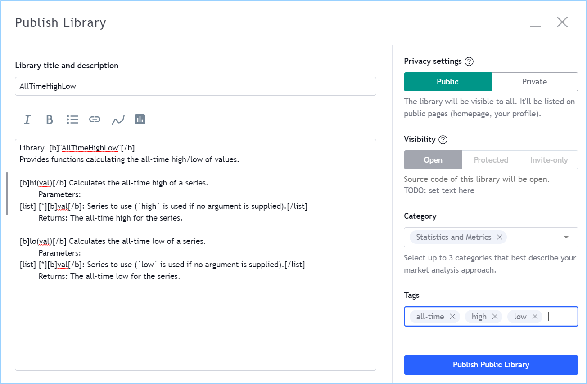
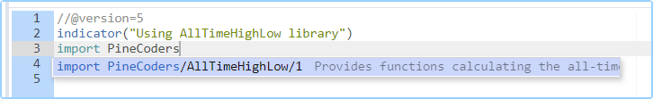

Libraries
=========

.. contents:: :local:
    :depth: 3

Introduction
------------
Pine libraries are publications containing functions that can be reused in Pine indicators, strategies, or in other libraries. They are useful to define frequently-used functions so their source code does not have to be included in every script where they are needed.

A library must be published (privately or publicly) before it can be used in another script. All libraries are published open-source. Public scripts can only use public libraries. Private scripts or personal scripts saved in the Pine Editor can use public or private libraries. A library can use other libraries, or even previous versions of itself.

Library programmers should be familiar with Pine's typing nomenclature, scopes and user-defined functions. If you need to brush up on Pine forms and types, see the User Manual's page on the :doc:`/language/Type_system`. For user-defined functions and scopes, see :doc:`/language/Declaring_functions`.

Creating a library
------------------

A Pine library is a special kind of script that begins with the `library() <https://www.tradingview.com/pine-script-reference/v5/#fun_library>`__ declaration statement, rather than `indicator() <https://www.tradingview.com/pine-script-reference/v5/#fun_indicator>`__ or `strategy() <https://www.tradingview.com/pine-script-reference/v5/#fun_strategy>`__. A library contains exportable function definitions, which constitute the only visible part of the library when it is used by another script. Libraries can also use other Pine code in their global scope, like a normal indicator. This code will typically serve to demonstrate how to use the library's functions.

A library script has the following structure, where one or more exportable functions must be defined::

    //@version=5

    // @description <library_description>
    library(title, shorttitle, overlay, format, precision, scale)

    <script_code>

    // @function <function_description>
    // @param <parameter> <parameter_description>
    // @returns <return_value_description>
    export <function_name>([simple/series] <parameter_type> <parameter_name> [= <default_value>] [, ...]) =>
        <function_code>

    <script_code>

Note that:

- The ``// @description``, ``// @function``, ``// @param`` and ``// @returns`` compiler directives are optional but we highly recommend you use them. They serve a double purpose: document the library's code and populate the default library description which authors can use when publishing the library.
- The `export <https://www.tradingview.com/pine-script-reference/v5/#op_export>`__ keyword is mandatory.
- <parameter_type> is mandatory, contrary to user-defined function parameter definitions in indicators or strategies, which are typeless.
- <script_code> can be any code you would normally use in an indicator, including inputs or plots.

This is an example library::

    //@version=5

    // @description Provides functions calculating the all-time high/low of values.
    library("AllTimeHighLow", "", true)

    // @function Calculates the all-time high of a series.
    // @param val Series to use (`high` is used if no argument is supplied).
    // @returns The all-time high for the series.
    export hi(float val = high) =>
        var float ath = val
        ath := math.max(ath, val)

    // @function Calculates the all-time low of a series.
    // @param val Series to use (`low` is used if no argument is supplied).
    // @returns The all-time low for the series.
    export lo(float val = low) =>
        var float atl = val
        atl := math.min(atl, val)

    plot(hi())
    plot(lo())

Library functions
^^^^^^^^^^^^^^^^^

Function definitions in libraries are slightly different than those of user-defined functions in indicators and strategies. There are constraints as to what can be included in the body of library functions.

In library function signatures (their first line):

- The `export <https://demo-alerts.xstaging.tv/pine-script-reference/v5/#op_export>`__ keyword is mandatory.
- The type of argument expected for each parameter must be explicitly mentioned.
- A `simple <https://www.tradingview.com/pine-script-reference/v5/#op_simple>`__ or `series <https://www.tradingview.com/pine-script-reference/v5/#op_series>`__ form modifier can restrict the allowable forms of arguments (the next section explains their use).

In library function code:

- You cannot use variables from the library's global scope unless they are of "const" form. This means you cannot use global variables initialized from script inputs, for example, or globally declared arrays.
- You cannot use functions in the ``request.*()`` namespace.

Library functions always return a result that is either of "simple" or "series" form. You cannot use them to calculate values where "const" or "input" forms are required, as is the case with some Pine built-in function arguments. For example, a library function cannot be used to calculate an argument for the ``show_last`` parameter in a `plot() <https://www.tradingview.com/pine-script-reference/v5/#fun_plot>`__ call, because an "input int" argument is required for ``show_last``.

Argument form control
^^^^^^^^^^^^^^^^^^^^^

The form of arguments supplied in calls to library functions is autodetected based on how the argument is used inside the function. If the argument can be used in "series" form, it is. If it cannot, an attempt is made with the "simple" type form. This explains why this code::

    export myEma(int x) =>
        ta.ema(close, x)

will work when called using ``t.myEma(20)``, even though `ta.ema() <https://www.tradingview.com/pine-script-reference/v5/#fun_ta{dot}ema>`__'s ``length`` parameter requires a "simple int" argument. When the Pine compiler detects that a "series" length cannot be used with `ta.ema() <https://www.tradingview.com/pine-script-reference/v5/#fun_ta{dot}ema>`__, it tries the "simple" form, which in this case is allowed.

While library functions cannot return results of "const" or "input" forms, they can be written to produce a result of "simple" form. This makes them useful in more contexts than functions returning a result of "series" form, because some Pine built-in functions do not allow "series" arguments. For example, `request.security() <https://www.tradingview.com/pine-script-reference/v5/#fun_request{dot}security>`__ requires a "simple string" for its ``symbol`` parameter. If we wrote a library function to assemble the argument to ``symbol`` in the following way, the function's result would not work because it is of "series" form::

    export makeTickerid(string prefix, string ticker) =>
        prefix + ":" + ticker

However, by restricting the form of its parameters to "simple", we could force the function to yield a "simple" result. We can achieve this by prefixing the parameters' type with the `simple <https://www.tradingview.com/pine-script-reference/v5/#op_simple>`__ keyword::

    export makeTickerid(simple string prefix, simple string ticker) =>
        prefix + ":" + ticker

Note that for the function to return a "simple" result, no "series" values can be used in its calculation; otherwise the result will be of "series" form.

One can also use the `series <https://www.tradingview.com/pine-script-reference/v5/#op_simple>`__ keyword to prefix the type of a library function parameter. However, because arguments are by default cast to the "series" form, using the `series <https://www.tradingview.com/pine-script-reference/v5/#op_simple>`__ modifier is redundant; it exists more for completeness.

Publishing a library
--------------------

Before you or other Pine coders can reuse any library, it must be published. If you want to share your library with all TradingViewers, publish it publicly. To use it privately, use a private publication. As with indicators or strategies, the active chart when you publish a library will appear in both its widget (the small placeholder denoting libraries in the TradingView scripts stream) and script page (the page users see when they click on the widget).

After adding our example library to the chart and setting up a clean chart showing our library plots the way we want them, we use the Pine Editor's "Publish Script" button. The "Publish Library" window comes up:

Note that:

- We leave the library's title as is (the ``title`` argument in our `library() <https://www.tradingview.com/pine-script-reference/v5/#fun_library>`__ declaration statement is used as the default). While you can change the publication's title, it is preferable to keep its default value because the ``title`` argument is used to reference imported libraries in the `import <https://www.tradingview.com/pine-script-reference/v5/#op_import>`__ statement. It makes life easier for library users when your publication's title matches the actual name of the library.
- A default description is built from the compiler directives we used in our library. We will publish the library wihout retouching it.
- We chose to publish our library publicly, so it will be visible to all TradingViewers.
- We do not have the possibility of selecting a visibility type other than "Open" because libraries are always open-source.
- The list of categories for libraries is different than for indicators and strategies. We have selected the "Statistics and Metrics" category.
- We have added some custom tags: "all-time", "high" and "low".

The intended users of public libraries being other Pine coders; the better you explain and document your library's functions, the more chances others will use them. Providing examples demonstrating how to use your library's functions in your publication's code will also help.

House Rules
^^^^^^^^^^^

Public libraries are considered public domain code in our `House Rules on Script Publishing <https://www.tradingview.com/house-rules/?solution=43000590599>`__, which entails that, contrary to open-source indicators and strategies, permission is **not** required from their author if you reuse their functions in your open-source scripts. If you intend to reuse a public library's functions in a public, closed-source publication (protected or invite-only), explicit permission for reuse in that form **is** required from its author.

With the provision that public Pine libraries are considered to be "public domain", our House Rules on the reuse of open-source Pine scripts apply to them:

- You must obtain permission from the original author, unless the original code meets our "public domain" criteria.
- You must credit the author in your publication's description. It is also good form to credit in open-source comments.
- You must make significant improvements to the original code base, and it must account for a small proportion of your script.
- Your script must also be published open-source, unless explicit permission to that effect was granted by the original author, or unless the reused code is considered public domain AND it constitutes an insignificant part of your codebase.

Using a library
---------------

Using a library from another script (which can be an indicator, a strategy or another library), is done through the `import <https://www.tradingview.com/pine-script-reference/v5/#op_import>`__ statement::

    import <username>/<libraryName>/<libraryVersion> [as <alias>]

where:

- The <username>/<libraryName>/<libraryVersion> path will uniquely identify the library.
- The ``as <alias>`` part is optional. When used, it defines the namespace that will refer to the library's functions. For example, if you import a library using the ``allTime`` alias as we do in the example below, you will refer to that library's functions as ``allTime.<function_mame>()``. When no alias is defined, the library's name becomes its namespace.

To use the library we published in the previous section, our next script will require an `import <https://www.tradingview.com/pine-script-reference/v5/#op_import>`__ statement::

    import PineCoders/AllTimeHighLow/1 as allTime

As we type the user name of the library's author, a popup appears providing selections that match the available libraries:

This is an indicator that reuses our library::

    //@version=5
    indicator("Using AllTimeHighLow library", "", true)
    import PineCoders/AllTimeHighLow/1 as allTime

    plot(allTime.hi())
    plot(allTime.lo())
    plot(allTime.hi(close))

Note that:

- We have chosen to use the "allTime" alias for the library's instance in our script. When typing that alias in the Editor, a popup will appear to help you select the particular function you want to use from the library.
- We use the library's ``hi()`` and ``lo()`` functions without an argument, so the default `high <https://www.tradingview.com/pine-script-reference/v5/#var_high>`__ and `low <https://www.tradingview.com/pine-script-reference/v5/#var_low>`__ built-in variables will be used for their series, respectively.
- We use a second call to ``allTime.hi()``, but this time using `close <https://www.tradingview.com/pine-script-reference/v5/#var_close>`__ as its argument, to plot the highest `close <https://www.tradingview.com/pine-script-reference/v5/#var_close>`__ in the chart's history.

Examples
--------

These publications are examples of libraries published on TradingView:

- 

